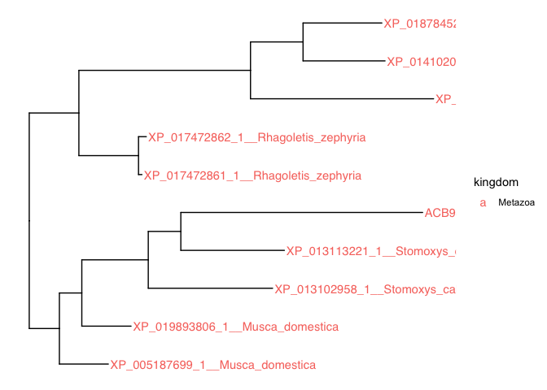

<!-- README.md is generated from README.Rmd. Please edit that file -->

# phyloR

<!-- badges: start -->

[](https://github.com/cparsania/tidywrappers)
[](https://www.tidyverse.org/lifecycle/#experimental)
<!-- badges: end -->

`phyloR` is an R package to deal with NCBI-BLAST output. It helps to
pre-process BLAST tabular output for downstream phylogenetic analysis.

## Install

``` r
if(require("devtools")){
        devtools::install_github("cparsania/phyloR")
} else{
        install.packages("devtools")
        devtools::install_github("cparsania/phyloR")
}
```

## Assign column names to blast tabular output

``` r

blast_out_file <- system.file("extdata" ,"blast_output_01.txt", package = "phyloR")
blast_out_tbl <- readr::read_delim(blast_out_file , delim = "\t" , comment = "#" ,col_names = F)

colnames(blast_out_tbl) <- phyloR::get_blast_outformat_7_colnames()
colnames(blast_out_tbl)
#>  [1] "query_acc_ver"    "subject_acc_ver"  "identity"         "alignment_length"
#>  [5] "mismatches"       "gap_opens"        "q_start"          "q_end"           
#>  [9] "s_start"          "s_end"            "evalue"           "bit_score"       
#> [13] "positives"
```

## Filter blast hits

One can filter blast hits by individual or combinations of these
variables.

  - e-value
  - bitscore
  - query coverage
  - percent identity

<!-- end list -->

``` r

## evalue <= 1e-5

blast_out_tbl %>% phyloR::filter_blast_hits(evalue = 1e-5)
#> # A tibble: 545 x 13
#>    query_acc_ver subject_acc_ver identity alignment_length mismatches gap_opens
#>    <chr>         <chr>              <dbl>            <dbl>      <dbl>     <dbl>
#>  1 KAE8371401.1  KAE8371401.1       100                253          0         0
#>  2 KAE8371401.1  XP_031924425.1      71.3              247         71         0
#>  3 KAE8371401.1  XP_031940570.1      66.4              247         83         0
#>  4 KAE8371401.1  KAB8261773.1        66.0              247         84         0
#>  5 KAE8371401.1  XP_022392557.1      64.4              247         69         1
#>  6 KAE8371401.1  OQD81666.1          61.7              248         95         0
#>  7 KAE8371401.1  GES63448.1          39.3              229        135         3
#>  8 KAE8371401.1  XP_001214927.1      39.3              229        135         3
#>  9 KAE8371401.1  OQD86157.1          38.6              228        132         3
#> 10 KAE8371401.1  XP_002375911.1      39.1              230        129         5
#> # … with 535 more rows, and 7 more variables: q_start <dbl>, q_end <dbl>,
#> #   s_start <dbl>, s_end <dbl>, evalue <dbl>, bit_score <dbl>, positives <dbl>

##  Filter blast hits : bitscore >= 200

blast_out_tbl %>% phyloR::filter_blast_hits(bit_score = 200)
#> # A tibble: 6 x 13
#>   query_acc_ver subject_acc_ver identity alignment_length mismatches gap_opens
#>   <chr>         <chr>              <dbl>            <dbl>      <dbl>     <dbl>
#> 1 KAE8371401.1  KAE8371401.1       100                253          0         0
#> 2 KAE8371401.1  XP_031924425.1      71.3              247         71         0
#> 3 KAE8371401.1  XP_031940570.1      66.4              247         83         0
#> 4 KAE8371401.1  KAB8261773.1        66.0              247         84         0
#> 5 KAE8371401.1  XP_022392557.1      64.4              247         69         1
#> 6 KAE8371401.1  OQD81666.1          61.7              248         95         0
#> # … with 7 more variables: q_start <dbl>, q_end <dbl>, s_start <dbl>,
#> #   s_end <dbl>, evalue <dbl>, bit_score <dbl>, positives <dbl>

##  Filter blast hits : query coverage >= 90

blast_out_tbl %>% phyloR::filter_blast_hits(query_cov = 90, query_length = 253)
#> # A tibble: 89 x 13
#>    query_acc_ver subject_acc_ver identity alignment_length mismatches gap_opens
#>    <chr>         <chr>              <dbl>            <dbl>      <dbl>     <dbl>
#>  1 KAE8371401.1  KAE8371401.1       100                253          0         0
#>  2 KAE8371401.1  XP_031924425.1      71.3              247         71         0
#>  3 KAE8371401.1  XP_031940570.1      66.4              247         83         0
#>  4 KAE8371401.1  KAB8261773.1        66.0              247         84         0
#>  5 KAE8371401.1  XP_022392557.1      64.4              247         69         1
#>  6 KAE8371401.1  OQD81666.1          61.7              248         95         0
#>  7 KAE8371401.1  GES63448.1          39.3              229        135         3
#>  8 KAE8371401.1  XP_001214927.1      39.3              229        135         3
#>  9 KAE8371401.1  XP_002375911.1      39.1              230        129         5
#> 10 KAE8371401.1  OQD72420.1          40                230        127         5
#> # … with 79 more rows, and 7 more variables: q_start <dbl>, q_end <dbl>,
#> #   s_start <dbl>, s_end <dbl>, evalue <dbl>, bit_score <dbl>, positives <dbl>

##  Filter blast hits : percent identity >= 90

blast_out_tbl %>% phyloR::filter_blast_hits(identity = 90)
#> # A tibble: 1 x 13
#>   query_acc_ver subject_acc_ver identity alignment_length mismatches gap_opens
#>   <chr>         <chr>              <dbl>            <dbl>      <dbl>     <dbl>
#> 1 KAE8371401.1  KAE8371401.1         100              253          0         0
#> # … with 7 more variables: q_start <dbl>, q_end <dbl>, s_start <dbl>,
#> #   s_end <dbl>, evalue <dbl>, bit_score <dbl>, positives <dbl>

##  Filter blast hits : evalue <= 1e-5, bitscore >= 200, query coverage >= 90, percent identity >= 60, 

blast_out_tbl %>% phyloR::filter_blast_hits(evalue = 1e-5, bit_score = 200, query_cov = 90, query_length = 253, identity = 60)
#> # A tibble: 6 x 13
#>   query_acc_ver subject_acc_ver identity alignment_length mismatches gap_opens
#>   <chr>         <chr>              <dbl>            <dbl>      <dbl>     <dbl>
#> 1 KAE8371401.1  KAE8371401.1       100                253          0         0
#> 2 KAE8371401.1  XP_031924425.1      71.3              247         71         0
#> 3 KAE8371401.1  XP_031940570.1      66.4              247         83         0
#> 4 KAE8371401.1  KAB8261773.1        66.0              247         84         0
#> 5 KAE8371401.1  XP_022392557.1      64.4              247         69         1
#> 6 KAE8371401.1  OQD81666.1          61.7              248         95         0
#> # … with 7 more variables: q_start <dbl>, q_end <dbl>, s_start <dbl>,
#> #   s_end <dbl>, evalue <dbl>, bit_score <dbl>, positives <dbl>
```

## Format fasta headers

Fasta file downloaded as an output of blast result has fasta headers of
two types

1)  Headers with alignment co-ordinates - if only aligned sequences
    downloaded.

<!-- end list -->

  - E.g. `KAE8371401.1:1-253 trypsin-like cysteine/serine peptidase
    domain-containing protein [Aspergillus bertholletius]`

<!-- end list -->

2)  Headers without alignment co-ordinates - if full sequences
    downloaded.

<!-- end list -->

  - E.g. `KAE8371401.1 trypsin-like cysteine/serine peptidase
    domain-containing protein [Aspergillus bertholletius]`

By default, `phyloR::format_fasta_headers()` divides headers in three
(header type 2) or four (header type 1) groups delimited by 2
underscores (`__`).

1)  subject id
2)  alignment coordinates (Optional for header type 1)
3)  subject description
4)  subject species

One can drop alignment coordinates from sequence headers by keeping
argument `keep_alignemnt_coord = FALSE`

``` r

fa_file <- system.file("extdata" ,"blast_output_01.fasta", package = "phyloR")
fa <- Biostrings::readBStringSet(fa_file)

## existing headers 

names(fa) %>% head()
#> [1] "KAE8371401.1:1-253 trypsin-like cysteine/serine peptidase domain-containing protein [Aspergillus bertholletius]" 
#> [2] "XP_031924425.1:1-247 trypsin-like cysteine/serine peptidase domain-containing protein [Aspergillus caelatus]"    
#> [3] "XP_031940570.1:1-247 trypsin-like cysteine/serine peptidase domain-containing protein [Aspergillus pseudonomius]"
#> [4] "KAB8261773.1:1-247 trypsin-like cysteine/serine peptidase domain-containing protein [Aspergillus pseudonomius]"  
#> [5] "XP_022392557.1:1-228 hypothetical protein ABOM_003016 [Aspergillus bombycis]"                                    
#> [6] "OQD81666.1:1-248 hypothetical protein PENANT_c026G03216 [Penicillium antarcticum]"

## new headers 

fa_file %>% phyloR::format_fasta_headers() %>% names() %>% head()
#> [1] "KAE8371401_1__1_253__trypsin_like_cysteine_serine_peptidase_domain_containing_protein__Aspergillus_bertholletius" 
#> [2] "XP_031924425_1__1_247__trypsin_like_cysteine_serine_peptidase_domain_containing_protein__Aspergillus_caelatus"    
#> [3] "XP_031940570_1__1_247__trypsin_like_cysteine_serine_peptidase_domain_containing_protein__Aspergillus_pseudonomius"
#> [4] "KAB8261773_1__1_247__trypsin_like_cysteine_serine_peptidase_domain_containing_protein__Aspergillus_pseudonomius"  
#> [5] "XP_022392557_1__1_228__hypothetical_protein_ABOM_003016__Aspergillus_bombycis"                                    
#> [6] "OQD81666_1__1_248__hypothetical_protein_PENANT_c026G03216__Penicillium_antarcticum"

## drop alignment co-ordinates

fa_file %>% phyloR::format_fasta_headers(keep_alignemnt_coord = FALSE) %>% names() %>% head()
#> [1] "KAE8371401_1__trypsin_like_cysteine_serine_peptidase_domain_containing_protein__Aspergillus_bertholletius" 
#> [2] "XP_031924425_1__trypsin_like_cysteine_serine_peptidase_domain_containing_protein__Aspergillus_caelatus"    
#> [3] "XP_031940570_1__trypsin_like_cysteine_serine_peptidase_domain_containing_protein__Aspergillus_pseudonomius"
#> [4] "KAB8261773_1__trypsin_like_cysteine_serine_peptidase_domain_containing_protein__Aspergillus_pseudonomius"  
#> [5] "XP_022392557_1__hypothetical_protein_ABOM_003016__Aspergillus_bombycis"                                    
#> [6] "OQD81666_1__hypothetical_protein_PENANT_c026G03216__Penicillium_antarcticum"
```

## Remove redundant hits from blast tabular ouput

BLAST reports same subject hit multiple time with different alignment
co-ordinates. For a same subjet id, `phyloR::remove_redundant_hits()`
select longest subject hit out of given multiples.

``` r
blast_out_tbl %>% phyloR::remove_redundant_hits()
#> # A tibble: 716 x 13
#>    query_acc_ver subject_acc_ver identity alignment_length mismatches gap_opens
#>    <chr>         <chr>              <dbl>            <dbl>      <dbl>     <dbl>
#>  1 KAE8371401.1  1FN8_A              31.6              209        127         6
#>  2 KAE8371401.1  1GDU_A              31.9              210        127         6
#>  3 KAE8371401.1  1PPZ_A              31.9              210        127         6
#>  4 KAE8371401.1  AAQ04074.1          27.5              218        135         9
#>  5 KAE8371401.1  AAR91718.1          30.8              117         73         2
#>  6 KAE8371401.1  AAR91719.1          28.7              157         94         6
#>  7 KAE8371401.1  AAW31593.1          27.2              228        147         6
#>  8 KAE8371401.1  ADK37838.1          29.5              227        136         9
#>  9 KAE8371401.1  ADY16698.1          35.5              242        151         4
#> 10 KAE8371401.1  AER28315.1          30.5              236        148         5
#> # … with 706 more rows, and 7 more variables: q_start <dbl>, q_end <dbl>,
#> #   s_start <dbl>, s_end <dbl>, evalue <dbl>, bit_score <dbl>, positives <dbl>
```

## Subset fasta sequences

After filtering hits from tabular blast output, next obvious question is
to filter same sequences from a fasta file and write them to new file.
`phyloR::subset_bstringset()` subset the sequences from a fasta using a
vector of fasta headers.

``` r

fa_file <- system.file("extdata" ,"blast_output_01.fasta", package = "phyloR")
fa <- Biostrings::readBStringSet(fa_file)
query_headers <- fa %>% names() %>% sample(100)
seq_filtered <- phyloR::subset_bstringset(x = query_headers , y = fa, partial_match = F)

# One can use function `Biostrings::writeXStringSet()` to write filterd sequences to new fasta file. 
```

## Assign taxonomy columns to NCBI protein acession

phyloR allows you to assign NCBI taxonomy levels to NCBI protein
accession using function `phyloR::add_taxonomy_columns()`. One of the
applications of this function is to assign the NCBI taxonomy levels to
blast output, which is required for downstream phylogenetic analysis.
For example, a phylogenetic tree generated from blast hits often
required to color resultant tree branches either by kingdom, family or
any other NCBI taxonomy level. One can easily identify these taxonomy
levels using function `phyloR::add_taxonomy_columns()`

``` r

## add kingdom

with_kingdom <- blast_out_tbl %>% slice(1:10) %>% 
        phyloR::add_taxonomy_columns(ncbi_accession_colname = "subject_acc_ver", taxonomy_level = "kingdom")
#> No ENTREZ API key provided
#>  Get one via taxize::use_entrez()
#> See https://ncbiinsights.ncbi.nlm.nih.gov/2017/11/02/new-api-keys-for-the-e-utilities/
#> ✓ Done.  Time taken 5.23
#> ──────────────────────────────────────────────────────────────────────────────────────────────────────────────────────────────────────────────────────
#> ● Rank search begins...
#> ──────────────────────────────────────────────────────────────────────────────────────────────────────────────────────────────────────────────────────
#> ✓ Done.  Time taken 0.08


with_kingdom %>% dplyr::select(query_acc_ver, subject_acc_ver, kingdom)
#> # A tibble: 10 x 3
#>    query_acc_ver subject_acc_ver kingdom
#>    <chr>         <chr>           <chr>  
#>  1 KAE8371401.1  KAE8371401.1    Fungi  
#>  2 KAE8371401.1  XP_031924425.1  Fungi  
#>  3 KAE8371401.1  XP_031940570.1  Fungi  
#>  4 KAE8371401.1  KAB8261773.1    Fungi  
#>  5 KAE8371401.1  XP_022392557.1  Fungi  
#>  6 KAE8371401.1  OQD81666.1      Fungi  
#>  7 KAE8371401.1  GES63448.1      Fungi  
#>  8 KAE8371401.1  XP_001214927.1  Fungi  
#>  9 KAE8371401.1  OQD86157.1      Fungi  
#> 10 KAE8371401.1  XP_002375911.1  Fungi

## add family  

with_kingdom_and_family <- with_kingdom %>% phyloR::add_taxonomy_columns(ncbi_accession_colname = "subject_acc_ver" ,
                                                                  taxonomy_level = "family")
#> ── WARNING ───────────────────────────────────────────────────────────────────────────────────────────────────────────────────────────────────────────
#> ℹ As column 'taxid' present in blast output tbl, same will be used to map taxonomy level.
#> ℹ To perform new 'taxid' search either remove  or rename columnn 'taxid'.
#> ── WARNING ENDS ──────────────────────────────────────────────────────────────────────────────────────────────────────────────────────────────────────
#> ● Rank search begins...
#> ──────────────────────────────────────────────────────────────────────────────────────────────────────────────────────────────────────────────────────
#> ✓ Done.  Time taken 0.05

with_kingdom_and_family %>% dplyr::select(query_acc_ver, subject_acc_ver, kingdom, family )
#> # A tibble: 10 x 4
#>    query_acc_ver subject_acc_ver kingdom family        
#>    <chr>         <chr>           <chr>   <chr>         
#>  1 KAE8371401.1  KAE8371401.1    Fungi   Aspergillaceae
#>  2 KAE8371401.1  XP_031924425.1  Fungi   Aspergillaceae
#>  3 KAE8371401.1  XP_031940570.1  Fungi   Aspergillaceae
#>  4 KAE8371401.1  KAB8261773.1    Fungi   Aspergillaceae
#>  5 KAE8371401.1  XP_022392557.1  Fungi   Aspergillaceae
#>  6 KAE8371401.1  OQD81666.1      Fungi   Aspergillaceae
#>  7 KAE8371401.1  GES63448.1      Fungi   Aspergillaceae
#>  8 KAE8371401.1  XP_001214927.1  Fungi   Aspergillaceae
#>  9 KAE8371401.1  OQD86157.1      Fungi   Aspergillaceae
#> 10 KAE8371401.1  XP_002375911.1  Fungi   Aspergillaceae

## add species 

with_kingdom_family_and_species <- with_kingdom_and_family %>% phyloR::add_taxonomy_columns(ncbi_accession_colname = "subject_acc_ver" ,
                                                                  taxonomy_level = "species")
#> ── WARNING ───────────────────────────────────────────────────────────────────────────────────────────────────────────────────────────────────────────
#> ℹ As column 'taxid' present in blast output tbl, same will be used to map taxonomy level.
#> ℹ To perform new 'taxid' search either remove  or rename columnn 'taxid'.
#> ── WARNING ENDS ──────────────────────────────────────────────────────────────────────────────────────────────────────────────────────────────────────
#> ● Rank search begins...
#> ──────────────────────────────────────────────────────────────────────────────────────────────────────────────────────────────────────────────────────
#> ✓ Done.  Time taken 0.04

with_kingdom_family_and_species %>% dplyr::select(query_acc_ver, subject_acc_ver, kingdom, family ,species)
#> # A tibble: 10 x 5
#>    query_acc_ver subject_acc_ver kingdom family         species                 
#>    <chr>         <chr>           <chr>   <chr>          <chr>                   
#>  1 KAE8371401.1  KAE8371401.1    Fungi   Aspergillaceae Aspergillus bertholleti…
#>  2 KAE8371401.1  XP_031924425.1  Fungi   Aspergillaceae Aspergillus caelatus    
#>  3 KAE8371401.1  XP_031940570.1  Fungi   Aspergillaceae Aspergillus pseudonomius
#>  4 KAE8371401.1  KAB8261773.1    Fungi   Aspergillaceae Aspergillus pseudonomius
#>  5 KAE8371401.1  XP_022392557.1  Fungi   Aspergillaceae Aspergillus bombycis    
#>  6 KAE8371401.1  OQD81666.1      Fungi   Aspergillaceae Penicillium antarcticum 
#>  7 KAE8371401.1  GES63448.1      Fungi   Aspergillaceae Aspergillus terreus     
#>  8 KAE8371401.1  XP_001214927.1  Fungi   Aspergillaceae Aspergillus terreus     
#>  9 KAE8371401.1  OQD86157.1      Fungi   Aspergillaceae Penicillium antarcticum 
#> 10 KAE8371401.1  XP_002375911.1  Fungi   Aspergillaceae Aspergillus flavus
```

## Use NCBI taxonomy levels to color the phyloegenetic tree

An object of class `phylo` is widely used object to visualize the
phylogenetic tree in R. To gain more insights from the resultant
phylogenetic tree, often tree tips required to color by different levels
of taxonomy, for instance species, kingdom or family. Obtaining taxonomy
data to use them for tree annotations is not straight forward task and
require lots of data wrangling in R. phyloR provides handy way to map
such a taxonomy data to the phylogenetic tree. For example, one can
convert an object of class `phylo` to an object of class `tibble` and
vice versa. Once the tibble obtained, phyloR allows to add columns of
ncbi taxonomy levels. Resultant tibble can be passed to
`ggtree::ggtree()` to visualize the tree and taxonomy levels can be
used, for instance, to color the tree tips.

``` r

tree_string <- "((XP_005187699_1__Musca_domestica:0.070627277,(XP_019893806_1__Musca_domestica:0.071069674,((XP_013113221_1__Stomoxys_calcitrans:0.1494662042,ACB98719_1__Glossina_morsitans_morsitans:0.3489851076)67.4/100:0.0470213767,XP_013102958_1__Stomoxys_calcitrans:0.1794878827)98.1/100:0.0959227604)88.2/99:0.0323598861)93/99:0.0435291148,((XP_017472861_1__Rhagoletis_zephyria:0.0049337059,XP_017472862_1__Rhagoletis_zephyria:0.0112391294)97.3/100:0.0860969479,(XP_020713236_1__Ceratitis_capitata:0.2642805176,(XP_014102010_1__Bactrocera_oleae:0.1183517872,XP_018784523_1__Bactrocera_latifrons:0.1137567198)29.6/88:0.0758551876)99.9/100:0.247740081)92/100:0.0716529011)34.3/66:2.487103817;"

 tree_objct <- treeio::read.tree(text = tree_string)

 tree_tbl <- tree_objct %>% 
   ggtree::fortify()

 tree_tbl <- tree_tbl  %>%
         dplyr::mutate( seqid =  dplyr::case_when(isTip ~ stringr::str_replace(label , pattern = "__.*","" ) %>%  ## split by '__'
                                                         stringr::str_replace(pattern = "_\\d$" , ""), ## remove trailing digits from seqid
                                                  TRUE ~ label
         )
        )
 ## add taxonomy
 tree_tbl_with_taxonomy <- tree_tbl %>%
        phyloR::tidy_taxonomy_tree(ncbi_accession_colname = "seqid",taxonomy_levels = c("species" ,"kingdom","family"))
#> ✓ Done.  Time taken 3.3
#> ──────────────────────────────────────────────────────────────────────────────────────────────────────────────────────────────────────────────────────
#> ● Rank search begins...
#> ──────────────────────────────────────────────────────────────────────────────────────────────────────────────────────────────────────────────────────
#> ✓ Done.  Time taken 0.05
#> ── WARNING ───────────────────────────────────────────────────────────────────────────────────────────────────────────────────────────────────────────
#> ── WARNING ENDS ──────────────────────────────────────────────────────────────────────────────────────────────────────────────────────────────────────
#> ● Rank search begins...
#> ──────────────────────────────────────────────────────────────────────────────────────────────────────────────────────────────────────────────────────
#> ✓ Done.  Time taken 0.04
#> ── WARNING ───────────────────────────────────────────────────────────────────────────────────────────────────────────────────────────────────────────
#> ── WARNING ENDS ──────────────────────────────────────────────────────────────────────────────────────────────────────────────────────────────────────
#> ● Rank search begins...
#> ──────────────────────────────────────────────────────────────────────────────────────────────────────────────────────────────────────────────────────
#> ✓ Done.  Time taken 0.07

 ## visualize  tree

 # tips colored by species
 tree_tbl_with_taxonomy %>% ggtree::ggtree() + ggtree::geom_tiplab(ggplot2::aes(color = species, label = seqid),size = 20) + 
   ggplot2::theme(legend.position = "bottom" , legend.text = ggplot2::element_text(size= 50) , legend.title = ggplot2::element_text(size= 50))
```


``` r
 # tips colored by family
 tree_tbl_with_taxonomy %>% ggtree::ggtree() + ggtree::geom_tiplab(ggplot2::aes(color = family,label = seqid),size = 20) +
   ggplot2::theme(legend.position = "bottom" , legend.text = ggplot2::element_text(size= 50) , legend.title = ggplot2::element_text(size= 50))
```


``` r
 # tips colored by kingdom
 tree_tbl_with_taxonomy %>% ggtree::ggtree() + ggtree::geom_tiplab(ggplot2::aes(color = kingdom,label = seqid ),size =20) +
   ggplot2::theme(legend.position = "bottom" , legend.text = ggplot2::element_text(size= 50) , legend.title = ggplot2::element_text(size= 50))
```


